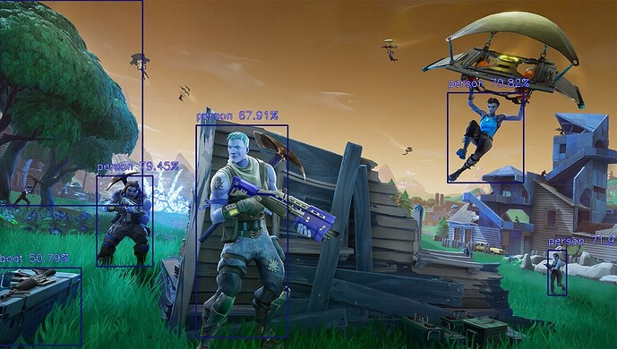

# Squad: Virtual Object Detector
This project aims to build object detection for the metaverse by training models with the [ImageAI](https://github.com/OlafenwaMoses/ImageAI) library on web images captured using [Puppeteer](https://github.com/puppeteer/puppeteer).

# Contents

- [👪 Squad](#-squad)
- [🏗 Initial Setup](#-initial-setup)
- [🏛 License](#-license)

# 👪 Squad

Lead: alextitonis (GitHub)

Grant Proposal: https://forum.algovera.ai/t/virtual-object-detector/25

Notion: https://algovera.notion.site/Squads-194768658a044302a0cdc24d5d758b9d?p=13587733017d4524832fd51f3780969a

# 🏗 Initial Setup 

## Set up environment

Open a new terminal and:
```console
#clone repo
git clone https://github.com/AlgoveraAI/squad-virtual-object-detector.git
cd squad-virtual-object-detector

#create a virtual environment
python3 -m venv venv

#activate env
source venv/bin/activate

#Install libraries.
```

# 🏛 License

The license is MIT. [Details](LICENSE)